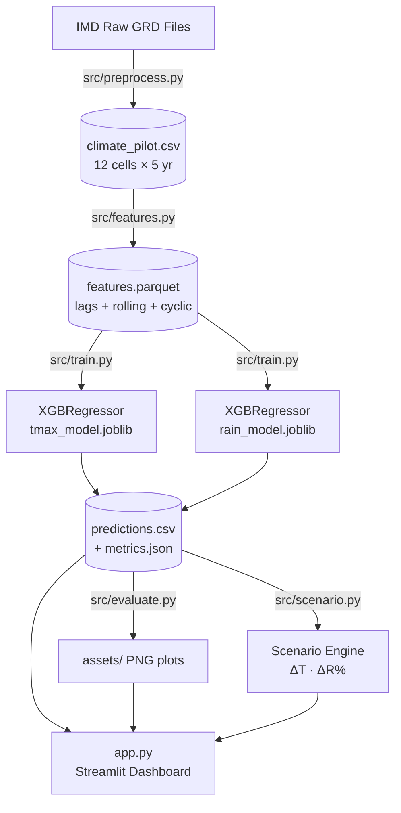

# BharatClimate Twin — Uttar Pradesh Pilot

> AI-powered climate digital twin for a 12-cell pilot region in Uttar Pradesh, India.
> Phase 1-6 prototype. Not an operational weather forecast system.

---

## Goal

Demonstrate a statistical AI climate digital twin that can:
1. Ingest real IMD gridded observational data (Tmax and Rainfall).
2. Learn next-day climate patterns using ML (XGBRegressor with lag and rolling features).
3. Apply user-controlled what-if scenario perturbations.
4. Visualise forecast, scenario, and risk insight in an interactive Streamlit dashboard.

---

## Digital Twin Concept

```
Observations (IMD)
     │
     ▼
Climate State  ── 12 one-degree grid cells, 2020–2024
     │
     ▼
ML Forecast  ──── XGBRegressor (global, all cells)
     │             lag 1/2/3/7, 7-day rolling stats, doy sin/cos
     ▼
Scenario Engine ─ T_scn = T_fcast + ΔT
                  R_scn = R_fcast × (1 + ΔR%)
     │
     ▼
Risk Insight ──── Heat cells ≥ 40 °C / Heavy rain ≥ 64.5 mm/day
                  (prototype operational thresholds)
```

---

## Pilot Region

| Parameter | Value |
|-----------|-------|
| Area | Central–Eastern Uttar Pradesh |
| Lat range | 25°N – 28°N |
| Lon range | 79°E – 83°E |
| Grid cells | 12 (1° × 1°, cell centres at *.5) |
| Period | 2020–2024 (1826 days per cell) |

---

## Data Sources

| Source | Variable | Native Resolution | Grid Used |
|--------|----------|------------------|-----------|
| IMD GRD (open) | Daily Tmax | 1° × 1° | 1° native |
| IMD GRD (open) | Daily Rainfall | 0.25° × 0.25° | Aggregated to 1° |

Rainfall at 0.25° resolution was spatially averaged onto the Tmax 1-degree cells in `src/preprocess.py`.

---

## Architecture Diagram



---

## Model and Features

### Feature Engineering (`src/features.py`)
- **Lags:** tmax_c and rain_mm lagged 1, 2, 3, 7 days (computed per cell)
- **Rolling stats:** 7-day rolling mean and std — shift-first to prevent data leakage
- **Temporal:** day-of-year sin/cos (annual cycle), calendar month
- **Spatial:** lat, lon (global model trained on all 12 cells jointly)

### Train / Validation / Test Split
| Split | Years | Purpose |
|-------|-------|---------|
| Train | 2020–2022 | Fit model |
| Validation | 2023 | Early stopping |
| Test | 2024 | Honest evaluation |

### Model
- **XGBRegressor** (1000 estimators, lr=0.05, max_depth=6, subsample=0.8)
- Early stopping on validation MAE (patience=30 rounds)
- Falls back to **HistGradientBoostingRegressor** if XGBoost unavailable
- One global model per variable (all 12 cells trained jointly)

---

## Evaluation Results (Test Set — 2024)

> ⚠️ These numbers are read directly from `models/metrics.json` generated by `src/train.py`.

| Variable | MAE | RMSE | Correlation | Persistence MAE | % vs Persistence | Rain/No-Rain Acc |
|----------|-----|------|-------------|-----------------|-----------------|-----------------|
| **Tmax (°C)** | **1.57** | **2.02** | **0.961** | 1.50 | −4.6% ¹ | — |
| **Rainfall (mm)** | **2.75** | **6.63** | **0.388** | 2.77 | +0.7% | **68.7%** |

> ¹ Tmax persistence is very strong for next-day stable conditions. The ML model matches closely
> (r=0.961) but is not uniformly better day-by-day. This is reported honestly.
> Rain skill is modest (r=0.388) — as expected for a highly stochastic variable with only 12 cells.

*Source: `models/metrics.json`, test year 2024.*

---

## Scenario Assumptions

- `T_scn = T_forecast + ΔT` — additive uniform offset to all cells
- `R_scn = R_forecast × (1 + ΔR / 100)` — multiplicative scaling, clipped at 0
- Thresholds: **Heat ≥ 40 °C**, **Heavy rain ≥ 64.5 mm/day** (prototype operational, not official)
- **⚠️ What-if sensitivity scenario — NOT a validated climate projection.**

---

## Limitations

1. **Small pilot region**: Only 12 cells covering part of UP
2. **Next-day forecast only**: No multi-day outlook
3. **Statistical ML model**: No physical equations or conservation laws
4. **No satellite data**: INSAT/MOSDAC integration is on the roadmap (not yet done)
5. **Short training period**: 5 years (2020–2024)
6. **Rainfall skill may be weak**: Rainfall is highly stochastic; ML improvement over persistence is modest

---

## Roadmap

- [ ] INSAT-3D/3DR MOSDAC LST, SST, and satellite-derived rainfall integration
- [ ] ConvLSTM / spatiotemporal deep learning model
- [ ] Ensemble-based uncertainty quantification
- [ ] Real-time IMD API data assimilation
- [ ] National scaling to all-India 1° grid
- [ ] Multi-day probabilistic forecasts

*INSAT/MOSDAC satellite data is NOT integrated in this prototype.*

---

## Screenshots

*(Run the dashboard and replace these with real screenshots)*

| Map View | Model Performance |
|----------|------------------|
|  |  |

---

## Run Instructions

### Prerequisites

```bash
git clone <repo>
cd bharatclimate-twin
python -m venv .venv
# Windows:
.venv\Scripts\activate
# Linux/macOS:
source .venv/bin/activate

pip install -r requirements.txt
```

### Run the full pipeline (Phase 2–3)

```bash
python run_all.py
```

### Launch the dashboard

```bash
streamlit run app.py
```

Open your browser to `http://localhost:8501`.

---

*BharatClimate Twin — Uttar Pradesh Pilot. Proof-of-concept prototype. Data: IMD open gridded data.*
